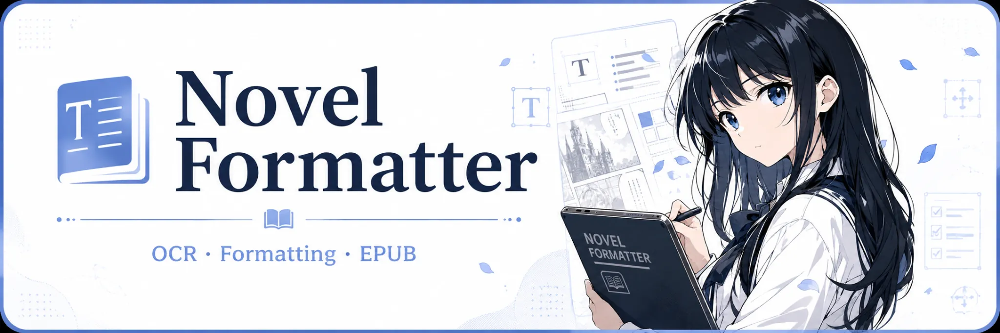

<p align="center">
  
</p>

<h1 align="center">Novel Formatter</h1>

<p align="center">面向日文竖排书籍的 OCR、校对、排版与 EPUB 制作工具，重点优化 macOS，同时支持 Windows。</p>

<p align="center">
  
  
  
  
  
</p>

> 日文竖排 OCR · 多模型对比与融合 · 图文对照 · Formatter · EPUB · AI 修复包 · Apple Vision

## 下载

优先从仓库 **Releases** 下载对应平台的最新安装包。

源码运行同样支持 macOS 与 Windows；部分 Apple 原生能力仅在 macOS 可用。

## 主要特性

- **图片 / PDF 导入**：支持图片、文件夹和 PDF 页面处理。
- **日文竖排 OCR**：针对日文书籍纵排、分列和跨列内容处理。
- **多模型 OCR 对比与融合**：可组合 Apple Vision、NDLOCR、Manga OCR、PaddleOCR、YomiToku 等结果进行复核。
- **图文对照校对**：结合原始页面与 OCR 结果检查错字、漏字、低置信度文本和版面问题。
- **Ruby / 页眉页码处理**：支持假名注音、页眉、页码、跨列和跨页文本整理。
- **Formatter 文本整理**：对 OCR 文本进行段落、标点、标题和跨页接续等后处理。
- **EPUB 制作**：从整理后的正文、结构和资源直接导出 EPUB。
- **AI 修复包**：导出 OCR 证据、正文、结构和资源，交给 GPT、Claude 等大模型继续复核并生成接近出版成品的 EPUB。
- **本地数据优先**：模型、缓存、日志、数据库和用户输出不作为项目源码提交。

## OCR 引擎

支持或可选：

- Apple Vision（macOS）
- NDLOCR
- Manga OCR
- PaddleOCR
- YomiToku

Apple Vision、Swift OCR Helper、Apple Pencil 手写识别仅在 macOS 可用。

## 推荐流程

1. 导入 PDF、图片或图片文件夹。
2. 标记封面、扉页、目录、插图、正文、后记等页面类型。
3. 在 OCR 页面选择模型，并根据版面开启分列。
4. 运行 OCR。
5. 在 OCR 对比和图文对照中处理模型分歧、漏字、Ruby、页码和跨页连接。
6. 应用融合结果并进行 Formatter 整理。
7. 直接导出 EPUB，或导出 AI 修复包继续处理。

## AI 修复包

AI 修复包用于把 OCR 证据、文本、结构和资源交给大模型继续复核，而不是只提供一份脱离版面的纯文本。

可以用于：

- OCR 错字、漏字和标点修复
- 人名、地名、术语一致性检查
- 跨页、跨章节语境复核
- EPUB 结构与排版检查
- 生成接近出版成品的最终 EPUB

## 安装与启动

推荐使用 Python 3.10 或更高版本。

### macOS

```bash
git clone https://github.com/Amster-Ilvil/Novel-formatter.git
cd Novel-formatter
python3 -m venv .venv
source .venv/bin/activate
python -m pip install -U pip
python -m pip install -r requirements.txt
python gui_pyside6.py
```

也可以直接运行：

```bash
./run_novel_formatter.command
```

### Windows

```powershell
git clone https://github.com/Amster-Ilvil/Novel-formatter.git
cd Novel-formatter
py -3 -m venv .venv
.\.venv\Scripts\Activate.ps1
python -m pip install -U pip
python -m pip install -r requirements.txt
python gui_pyside6.py
```

安装包可直接从 [Releases](https://github.com/Amster-Ilvil/Novel-formatter/releases) 下载。

## 平台说明

| 功能 | macOS | Windows |
|---|---:|---:|
| 主界面 | ✓ | ✓ |
| PDF / 图片 OCR | ✓ | ✓ |
| 多模型 OCR | ✓ | ✓ |
| Formatter / EPUB | ✓ | ✓ |
| AI 修复包 | ✓ | ✓ |
| Apple Vision | ✓ | — |
| Swift OCR Helper | ✓ | — |
| Apple Pencil 手写识别 | ✓ | — |

## 模型与本地数据

OCR 模型权重、缓存、虚拟环境、日志、数据库和用户输出不会作为项目源码提交。

首次使用部分 OCR 引擎时，程序会在本机准备所需依赖或模型文件。


## 参考项目与引用

本项目的界面、OCR 适配、文档处理和手写识别能力参考或使用了以下公开项目与官方文档：

- [Qt for Python / PySide6](https://doc.qt.io/qtforpython/)：桌面 GUI 框架。
- [Apple Vision](https://developer.apple.com/documentation/vision)：macOS 原生 OCR 与视觉识别能力。
- [PaddleOCR](https://github.com/PaddlePaddle/PaddleOCR)：通用 OCR 引擎与跨平台识别参考。
- [NDLOCR-Lite](https://github.com/ndl-lab/ndlocr-lite)：日文书籍 OCR 与版面识别参考。
- [Manga Image Translator](https://github.com/zyddnys/manga-image-translator)：漫画/日文 OCR、48px 模型接口与相关实现参考。
- [Open Model Zoo](https://github.com/openvinotoolkit/open_model_zoo)：可选手写识别模型与推理参考。
- [PyMuPDF](https://pymupdf.readthedocs.io/)：PDF 页面、图像与文字层处理。
- [python-docx](https://python-docx.readthedocs.io/)：DOCX 读取与生成。
- [Pillow](https://python-pillow.org/)：图像读取、裁切与预处理。
- [jlect-jhr](https://github.com/ZacharyRead/jlect-jhr)：日文手写识别辅助资源；许可证见 `third_party/jlect_jhr/LICENSE.txt`。

第三方项目、模型和资源仍适用其各自许可证；本仓库不重新发布 OCR 模型权重。

## 用途与许可

本项目原创代码与文档以 [MIT License](LICENSE) 开源，可在遵守许可证的前提下用于个人、学习、研究或商业用途。

第三方 OCR、模型、依赖和平台能力仍适用其各自许可证与使用条款；完整致谢见 [ACKNOWLEDGEMENTS.md](ACKNOWLEDGEMENTS.md)。
